## 说明

主要是收集整理一些iOS UI效果，这部分内容不足以单独成一个项目。但在之后开发需要用到时可以快速接上。

大致内容如下👇，持续更新中...

## 例子

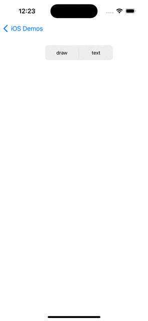

---
### TextMask

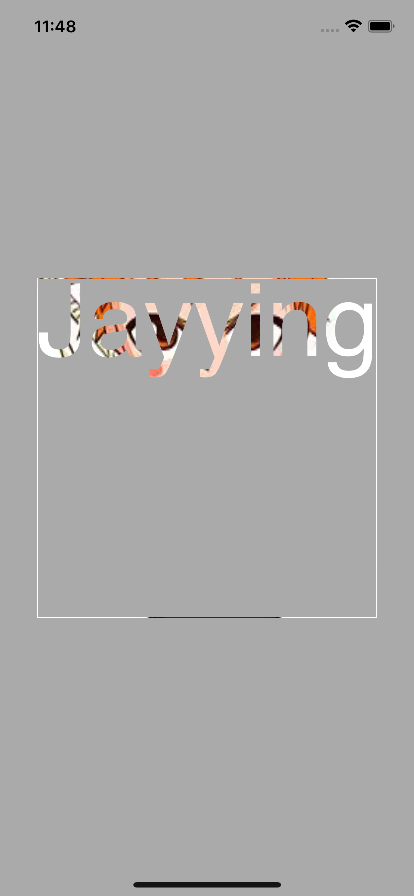

可以让一张图片只显示文字覆盖的地方；此外，这里还实现了自动调整字体大小，以撑满一行。

---
### ColumnarLayout

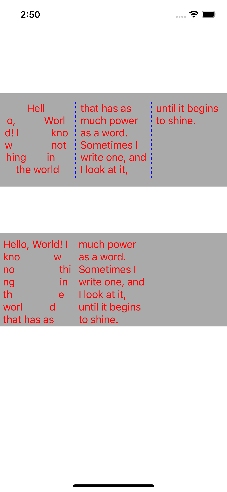

分别用CoreText和TextKit的方式，实现了文本不规则排版、分列排版

---
### CustomTextInput

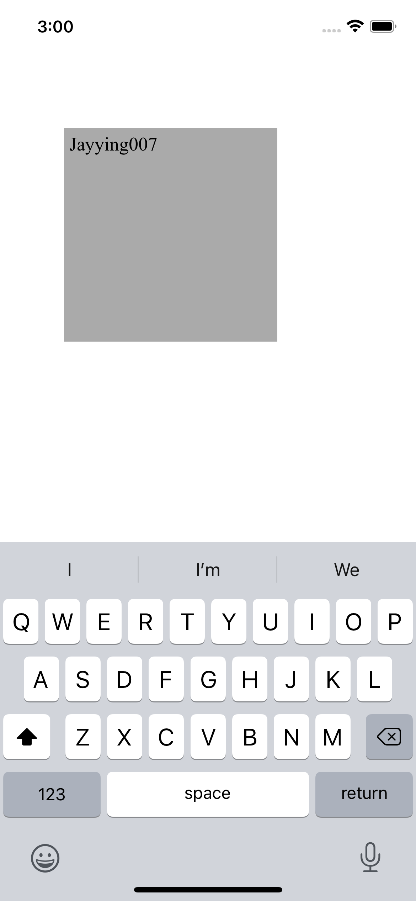

自定义TextView，不是继承自UITextView，而是继承自UIView，然后重写UITextInput相关逻辑。

代码大部分来自于苹果的例子：https://developer.apple.com/library/archive/samplecode/SimpleTextInput/Introduction/Intro.html

不过苹果的那个例子有好几个bug，这里做了修复。

---
### MMTextView

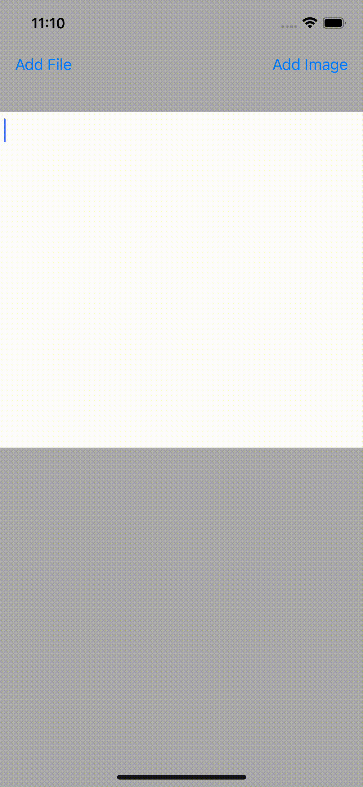

实现一个富文本编辑器，可以插入任意类型的UIView，也支持复制粘贴，代码精简。

---
### TextKitLayout

利用TextKit实现的几个小功能

---
### MMTextAnimationLabel

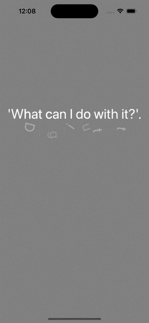

参考：https://github.com/OnePieceLv/TextKitAndAnimationEffect

---
### CoreTextMagazine
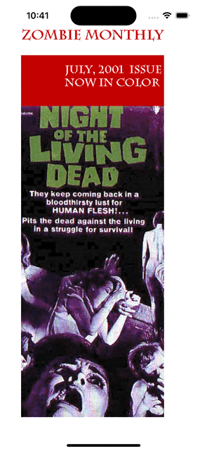

来自：https://www.kodeco.com/578-core-text-tutorial-for-ios-making-a-magazine-app的作品
其实跟上面ColumnarLayout有点像，就是多设置了pageEnabled

## 转场
相册A：
主要是学习两重动画的实现，其中对于下一个VC cell的计算，做简单处理了

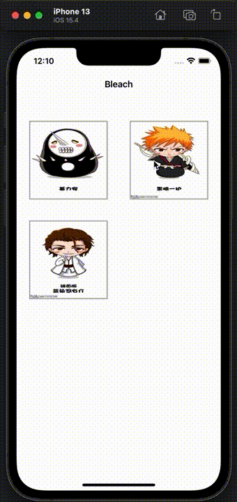

相册B：
类似苹果相册，用了在iOS10中引入的UIViewPropertyAnimator

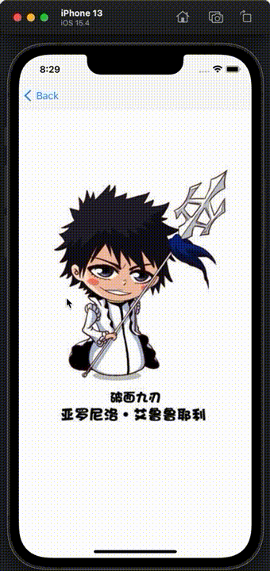

浮窗：
很简单的实现

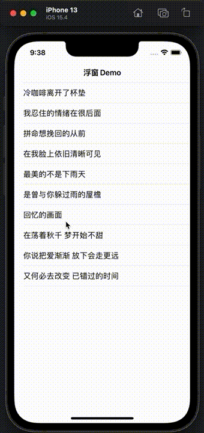

遮罩：
以原始View的位置为遮罩，逐渐拉开新的View。 注意不是由缩小到恢复正常哦。

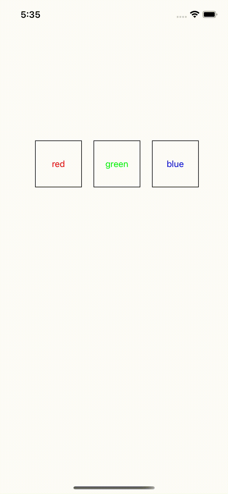